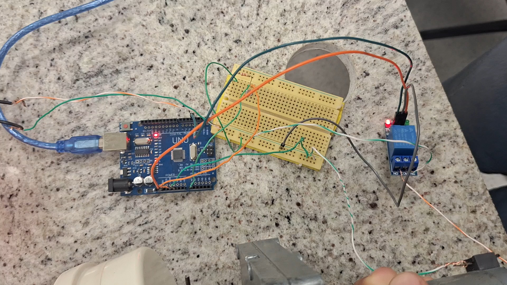

# Projeto de Alimentador Automático para Pets

## Disciplinas
- Sinais e Sistemas Lineares
- Eletrônica
- Microcontroladores/Microprocessadores

## Arquivos

### [ldrGetData.ino](ldrGetData.ino)
- **Descrição**: Código Arduino para realizar a leitura de valores de luminosidade usando um sensor LDR ao longo de 24 horas.
- **Detalhes**: O código `ldrGetData.ino` faz leituras do sensor LDR em intervalos de 30 segundos e armazena esses valores em um vetor para posterior análise. Aqui está como o código funciona:

  1. **Leitura do Sensor LDR**: A cada ciclo do `loop()`, o código lê o valor de luminosidade usando o sensor LDR conectado ao pino A0 do Arduino.
  
  2. **Armazenamento dos Valores**: Esses valores lidos são armazenados em um vetor de 48 posições, que corresponde a leituras realizadas a cada 30 minutos ao longo de 24 horas (48 leituras totais).
  
  3. **Controle de Índice**: A variável `indice` controla em qual posição do vetor o próximo valor será armazenado. O índice é incrementado a cada leitura até atingir o valor 48, correspondente ao número total de leituras necessárias para cobrir 24 horas.
  
  4. **Impressão dos Valores**: Após cada leitura e armazenamento, o código imprime os valores de todas as posições do vetor, o que permite o monitoramento dos dados de luminosidade ao longo do tempo.
  
  5. **Pausa após Completar as Leituras**: Quando o índice atinge 48, o código para de fazer novas leituras (usando um `delay` extremamente longo), já que todos os dados necessários foram coletados.
  
  6. **Intervalo de Leitura**: O código é configurado para realizar uma nova leitura a cada 30 segundos, o que resulta em 48 leituras no total durante 24 horas.
- **Execução**: Diretamente na plataforma do Arduino.

### [ldrRegression.ipynb](ldrRegression.ipynb)
- **Descrição**: Código Python para análise e tratamento dos dados coletados do sensor LDR, aplicando regressão e transformada de Fourier.
- **Detalhes**: Este código executa diversas operações para tratar os dados de luminosidade coletados ao longo de 24 horas pelo sensor LDR:

  1. **Visualização dos Dados**: A primeira etapa do código plota um gráfico de dispersão dos dados de luminosidade coletados ao longo do tempo (24 horas), para que possamos visualizar como os valores do sensor variam ao longo do dia.

  2. **Ajuste de Função Trapezoidal**: Utilizando o método `curve_fit` da biblioteca SciPy, o código ajusta uma função trapezoidal aos dados de luminosidade. Essa função modela o comportamento da luminosidade ao longo do tempo, capturando os períodos de subida, estabilização e queda, representando o ciclo diário da luz.
  
  3. **Plotagem da Função Ajustada**: Após o ajuste da função trapezoidal, o código plota um gráfico comparando os dados originais do sensor com a curva ajustada, permitindo uma visão clara de como a função modela os dados.

  4. **Transformada de Fourier (FFT)**: A transformada de Fourier é aplicada tanto aos dados originais quanto à função trapezoidal ajustada, permitindo analisar as frequências dominantes no sinal de luminosidade. Isso é útil para identificar ciclos e padrões repetitivos no comportamento da luz ao longo do dia.

  5. **Impressão dos Parâmetros Ajustados**:  Imprime os parâmetros ajustados da função trapezoidal (a, b, c, d e h), que definem o formato da curva e representam os pontos chave no ciclo da luminosidade diária.

- **Execução**: Pode ser executado na paltaforma Google Colab.

### [control.ino](control.ino)
- **Descrição**: Código de controle do acionamento do motor do alimentador.
- **Detalhes**: O código `control.ino` é responsável por monitorar o nível de luminosidade através de um sensor LDR e controlar o acionamento do motor que libera ração no alimentador. O funcionamento do código se dá da seguinte forma:

  1. **Leitura do Sensor LDR**: A cada segundo, o valor de luminosidade é lido do sensor e armazenado em um vetor. Após três leituras, a média desses valores é calculada.
  
  2. **Cálculo da Média**: Com base nas três últimas leituras de luminosidade, o código calcula a média dos valores. Esse cálculo garante que o sistema leve em consideração pequenas variações na luz ambiente, evitando acionamentos desnecessários do motor.
  
  3. **Condições para Ativar o Motor**: O motor é acionado apenas se dois critérios forem atendidos:
      - A média das leituras de luminosidade for superior a 50.
      - Já se passaram 10 horas desde o último acionamento do motor (para evitar acionamentos frequentes).
  
  4. **Acionamento do Motor**: Se as condições acima forem satisfeitas, o motor é ativado por 20 segundos, liberando a quantidade de ração configurada para o animal.
  
  5. **Intervalo de Ativação**: Após o acionamento, o sistema só voltará a acionar o motor após um intervalo de 10 horas, garantindo que o animal seja alimentado duas vezes ao dia.
  
  6. **Desativação do Motor**: O motor é desligado automaticamente após 20 segundos de funcionamento, e o ciclo de leitura da luminosidade e monitoramento do tempo recomeça.

- **Execução**: Diretamente na plataforma do Arduino.
## Vídeo do Projeto Funcionando

O projeto do alimentador automático funciona com o acionamento do motor para liberação de comida por 20 segundos em um intervalo de 10 horas. Ou seja, a cada 10 horas o motor é acionado e o alimento é liberado para o animal. Dessa forma, o alimentador tem o motor acionado duas vezes ao dia no período diurno. 
Entretanto, para exemplificar o funcionamento em vídeo, foi necessário limitar o tempo em que o motor fica em repouso. Dessa forma, ao invés de permanecer desligado pelo intervalo de 10 horas, o tempo foi reduzido para 10 segundos. Portanto, no vídeo apresentado obtemos o acionamento por 20 segundos do motor a cada 10 segundos de repouso.

[Assista ao vídeo do projeto](https://youtu.be/W1JV-Qg_nB8)

Este vídeo mostra o funcionamento do alimentador automático para animais de estimação. O sistema é composto por um Arduino Uno, uma fonte de alimentação e um relé, que controlam o motor do alimentador. O projeto foi configurado para alimentar um cão com aproximadamente 90g de ração duas vezes ao dia. Para garantir que o motor seja acionado apenas durante o dia, utilizamos um sensor LDR (Light Dependent Resistor).

No vídeo, o tempo de operação do motor e o intervalo entre os acionamentos foram reduzidos para uma demonstração mais clara e simplificada. O motor é acionado por 20 segundos, tempo calculado para dispensar 90g de ração em um intervalo de 10 horas entre os acionamentos. A visualização em tempo reduzido facilita a compreensão do funcionamento do sistema.

## Galeria de imagens
<!-- Linha 1 -->

  
  

<!-- Linha 2 -->

  
  

<!-- Linha 3 -->

  
  

<!-- Linha 4 -->

  
  

<!-- Linha 5 -->

  
  

